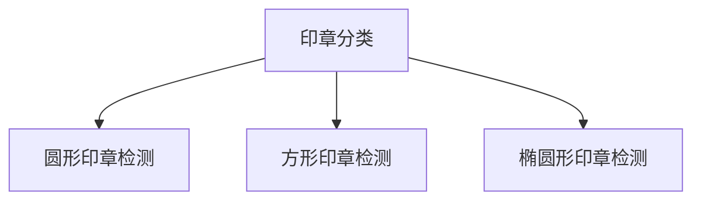

# 复杂环境下多种常见印章扫描件识别

## 思路

1. 传统cv定位，同时纠正椭圆印章的偏转角度纠正
2. deeplearning分类
3. 极坐标变换+ocr，同时完成圆和方形的偏转角度纠正与文字识别
4. paddleocr识别印章文字（需要本地部署服务和模型）

> 以后闲下来会打算用 rotate-yolo5 重构



## 使用

```bash
# window
set FLASK_APP=API.py
# linux
export FLASK_APP=API.py

flask run -h 0.0.0.0 -p 8000
```

## 其他一起开发的小伙伴

由于之前仓库放在 gitee 上面，所以这边手动放个链接

<a href="https://gitee.com/Sun_sui">
    
</a><a href="https://github.com/bear-zd">
    
</a>
