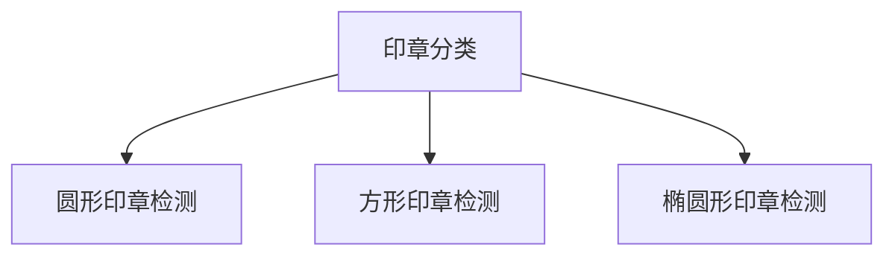

# 印章识别

1. 传统cv定位
2. deeplearning分类
3. 传统cv纠正印章偏转角度
4. paddleocr识别印章文字（需要本地部署服务和模型）

> 以后闲下来会打算用 rotate-yolo5 重构



```bash
# window
set FLASK_APP=API.py
# linux
export FLASK_APP=API.py

flask run -h 0.0.0.0 -p 8000
```
